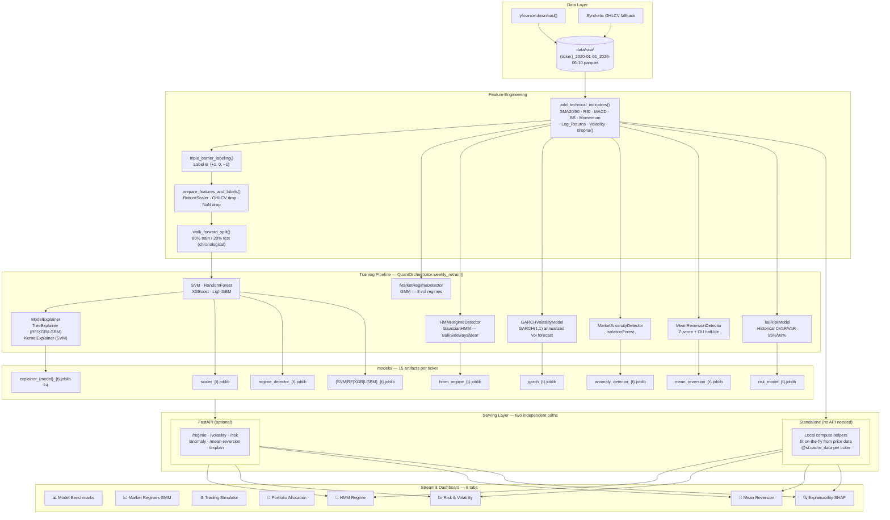
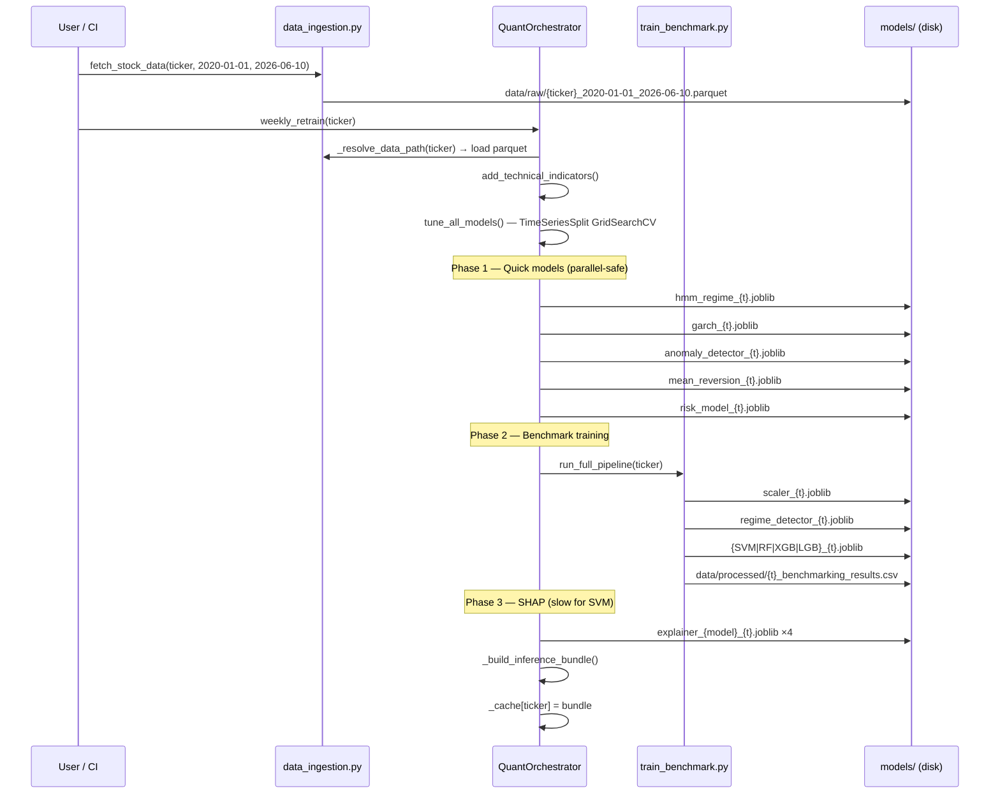
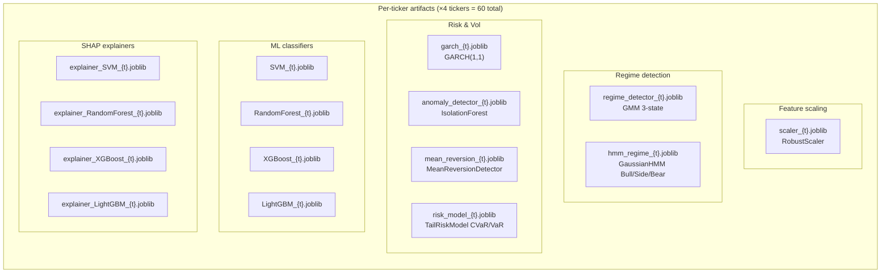
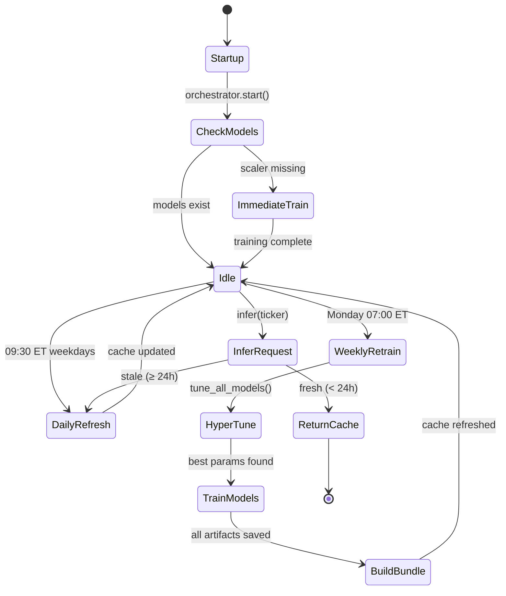

# Task-Oriented Benchmarking of Traditional ML Models in Stock Market Applications

## Live Demo (Streamlit Community Cloud)

Deploy the dynamic 10-tab dashboard to [Streamlit Community Cloud](https://share.streamlit.io):

1. Fork / push this repo to GitHub.
2. Go to **share.streamlit.io → New app**.
3. Set **Main file path** to `src/ui/dashboard.py`.
4. Click **Deploy** — `packages.txt` installs system deps automatically.

All charts compute live from yfinance on demand. Heavy compute (Model Benchmarks / SHAP) is
gated behind an explicit button so the app loads instantly on cold start.

---

## Project Overview

This project benchmarks traditional Machine Learning models (ARIMA, SVM, Gradient Boosting, Random Forest) within the stock market domain. The primary goal is to bridge the gap between statistical precision (MAE, RMSE, Accuracy) and practical financial performance (Sharpe Ratio, Max Drawdown).

The system implements seven advanced trading tasks layered on top of the benchmarks:

| Layer | Task | Model |
|---|---|---|
| 1 | Market Regime Detection (GMM) | `GaussianMixture` — 3 vol-based states |
| 2 | Market Regime Detection (HMM) | `GaussianHMM` — Bull/Sideways/Bear |
| 3 | Volatility Forecasting | `GARCH(1,1)` — forward annualized vol |
| 4 | Tail Risk Measurement | Historical CVaR / VaR at 95% & 99% |
| 5 | Anomaly Detection | `IsolationForest` — unusual market conditions |
| 6 | Mean Reversion Analysis | Z-score + Ornstein-Uhlenbeck half-life |
| 7 | Model Explainability | SHAP — `TreeExplainer` / `KernelExplainer` |

---

## Group 9

- Gregorius Willson — 2802449846
- Marco Oden Leo — 2802429453
- Yoel Nathanael — 2802445766

---

## System Architecture



---

## Standalone Dashboard (No API Required)

Tabs 5–8 compute their results **directly inside the Streamlit process** using price data already on disk — no FastAPI server, no trained artifacts needed.

```mermaid
flowchart LR
    DF["df_core_indicators\nfrom data/raw/*.parquet"] --> H1 & H2 & H3 & H4 & H5 & H6

    subgraph HELPERS["@st.cache_data helpers — fit once, instant on rerun"]
        H1["compute_hmm_local()\nHMMRegimeDetector.fit()\nMarketRegimeDetector fallback"]
        H2["compute_volatility_local()\nGARCHVolatilityModel.fit()\nannualized rolling vol"]
        H3["compute_risk_local()\nTailRiskModel.fit()\nCVaR · VaR · position scale"]
        H4["compute_anomaly_local()\nMarketAnomalyDetector.fit()\nIsolationForest on feature matrix"]
        H5["compute_mean_reversion_local()\nMeanReversionDetector.predict()\nZ-score · OU half-life · signal"]
        H6["compute_explain_local()\nloads scaler + model from disk\nModelExplainer.get_feature_importance()"]
    end

    H1 --> T5["🔮 HMM tab"]
    H2 & H3 & H4 --> T6["📉 Risk & Vol tab"]
    H5 --> T7["🔄 Mean Reversion tab"]
    H6 --> T8["🔍 Explainability tab"]
```



> **During training:** HMM, GARCH, CVaR, Anomaly, and Mean Reversion all fit on-the-fly from raw price history — real results are shown immediately.
> **After training:** SHAP Explainability additionally uses the saved `.joblib` models for accurate, training-data-derived importances.

---

## Full Training Pipeline



---

## Model Artifact Map

Each of the 4 tickers (AAPL · GOOGL · MSFT · TSLA) generates 15 `.joblib` artifacts:



---

## Daily Refresh vs Weekly Retrain

```mermaid
gantt
    title Orchestrator Schedule (ET)
    dateFormat HH:mm
    axisFormat %H:%M

    section Daily (weekdays)
    Fetch latest OHLCV          :done, 09:30, 5m
    Run anomaly detection        :done, 09:35, 2m
    Update inference cache       :done, 09:37, 1m

    section Weekly (Monday)
    Full hyperparameter tuning   :crit, 07:00, 45m
    Train HMM · GARCH · Risk     :07:45, 10m
    Train ML classifiers         :07:55, 20m
    Compute SHAP importances     :08:15, 30m
    Rebuild inference bundle     :08:45, 5m
```



---

## Project Structure

```text
.
├── data/
│   ├── raw/              # OHLCV Parquet files per ticker × date range
│   └── processed/        # Benchmarking result CSVs
├── models/               # 60 trained .joblib artifacts (15 per ticker)
├── docs/
│   ├── pipeline.md       # Extended pipeline Mermaid diagram
│   └── eda_plots/        # EDA visualisations
├── src/
│   ├── api/
│   │   └── main.py               # FastAPI — 9 endpoints
│   ├── features/
│   │   ├── preprocessing.py      # Triple barrier, RobustScaler, walk-forward split
│   │   └── technical_indicators.py
│   ├── models/
│   │   ├── anomaly_detector.py   # IsolationForest wrapper
│   │   ├── backtester.py         # Entry/Exit state machine
│   │   ├── explainability.py     # SHAP TreeExplainer / KernelExplainer
│   │   ├── market_regime.py      # GMM 3-state regime detector
│   │   ├── mean_reversion.py     # Z-score + OU half-life
│   │   ├── model_wrappers.py     # SVM / RF / XGB / LGBM / ARIMA adapters
│   │   ├── portfolio_hrp.py      # Hierarchical Risk Parity
│   │   ├── portfolio_sizing.py   # MVO + Risk Parity
│   │   ├── position_sizing.py    # Kelly + Volatility-adjusted sizing
│   │   ├── regime_hmm.py         # GaussianHMM Bull/Sideways/Bear
│   │   ├── risk_model.py         # TailRiskModel — CVaR / VaR
│   │   └── volatility_garch.py   # GARCH(1,1) annualized vol
│   ├── training/
│   │   └── hyperparameter_tuner.py  # TimeSeriesSplit + GridSearchCV
│   ├── ui/
│   │   └── dashboard.py          # Streamlit 8-tab dashboard (standalone)
│   ├── data_ingestion.py
│   ├── orchestrator.py           # QuantOrchestrator — scheduler + cache
│   └── train_benchmark.py        # Benchmark training pipeline
├── tests/
│   └── verification.py           # 16-step end-to-end smoke test
└── scripts/
    └── export_static.py          # CI: export JSON for GitHub Pages
```

---

## Setup & Installation

### Option A: Native setup with uv (recommended)

```bash
# Install uv: https://docs.astral.sh/uv/getting-started/installation/
uv sync

# Run smoke tests (16 checks)
uv run python tests/verification.py

# Full pipeline: ingest → train → serve
uv run python -c "
from src.data_ingestion import fetch_stock_data
for t in ['AAPL','GOOGL','MSFT','TSLA']:
    fetch_stock_data(t, '2020-01-01', '2026-06-10')
"

uv run python -c "
from src.orchestrator import QuantOrchestrator
orch = QuantOrchestrator(tickers=['AAPL','GOOGL','MSFT','TSLA'])
for t in ['AAPL','GOOGL','MSFT','TSLA']:
    orch.weekly_retrain(t)
"

# Dashboard (works standalone — no API needed)
uv run streamlit run src/ui/dashboard.py

# Optional: FastAPI backend for production inference
uv run uvicorn src.api.main:app --reload
```

### Option B: Docker

```bash
docker compose run --rm verify      # smoke tests
docker compose up api               # FastAPI on :8000
docker compose up dashboard         # Streamlit on :8501
```

### Option C: pip

```bash
python -m venv venv
source venv/bin/activate
pip install -r requirements.txt
```

---

## Dashboard Tabs

| # | Tab | Data source | What it shows |
|---|---|---|---|
| 1 | 📊 Model Benchmarks | `data/processed/*.csv` | Accuracy, Sharpe, drawdown for SVM/RF/XGB/LGBM/ARIMA |
| 2 | 📈 Market Regimes (GMM) | local model | Regime-colored price overlay, GMM cluster profile |
| 3 | ⚙️ Trading Simulator | local backtest | Equity curve, drawdown, position sizing modes |
| 4 | 💼 Portfolio Allocation | yfinance (live) | EW · RP · MVO · HRP weights + performance table |
| 5 | 🔮 Regime (HMM) | **local compute** | Current regime, transition probability heatmap |
| 6 | 📉 Risk & Volatility | **local compute** | GARCH forecast, CVaR/VaR metrics, anomaly flag |
| 7 | 🔄 Mean Reversion | **local compute** | Z-score chart, OU half-life, MR signal |
| 8 | 🔍 Explainability | **local compute** | SHAP feature importance bar chart + top-5 table |

> Tabs 5–8 are marked **local compute** — they work with no API server running, even before training completes, by fitting models on-the-fly from the price data on disk.

---

## API Endpoints

| Endpoint | Method | Description |
|---|---|---|
| `/` | GET | Health check |
| `/analyze` | POST | Full inference: predictions + positions + regime |
| `/status` | GET | Scheduler state, last refresh/retrain per ticker |
| `/regime/{ticker}` | GET | HMM + GMM regimes, transition matrix |
| `/volatility/{ticker}` | GET | GARCH forecast vol vs 20d rolling |
| `/portfolio` | POST | Portfolio weights (EW / RP / MVO / HRP) |
| `/anomaly/{ticker}` | GET | Isolation Forest anomaly flag + score |
| `/mean-reversion/{ticker}` | GET | Z-score, OU half-life, signal |
| `/risk/{ticker}` | GET | CVaR 95/99, VaR 95/99, position scale |
| `/explain/{ticker}/{model}` | GET | SHAP feature importances |

---

## Orchestrator & Auto-Refresh



---

## Key Evaluation Metrics

- **Statistical**: Classification Accuracy (hit rate on triple-barrier labels)
- **Financial**:
  - Sharpe Ratio (annualized, risk-free = 0)
  - Maximum Drawdown (peak-to-trough equity loss)
  - Total Return (cumulative strategy vs buy-hold)
  - CVaR 95%/99% (expected loss in worst tail)

---

## References

- De Prado, M. L. (2018). *Advances in Financial Machine Learning*. Wiley.
- De Prado, M. L. (2020). *Machine Learning for Asset Managers*. Springer.
- Engle, R. F. (1982). Autoregressive Conditional Heteroscedasticity. *Econometrica*.
- Heston, S. L. (1993). A Closed-Form Solution for Options with Stochastic Volatility.
- Hamilton, J. D. (1989). A New Approach to the Economic Analysis of Nonstationary Time Series. *Econometrica*.
- Tiangolo, S. *FastAPI Framework Documentation*.
- Streamlit Inc. *Streamlit Documentation*.
