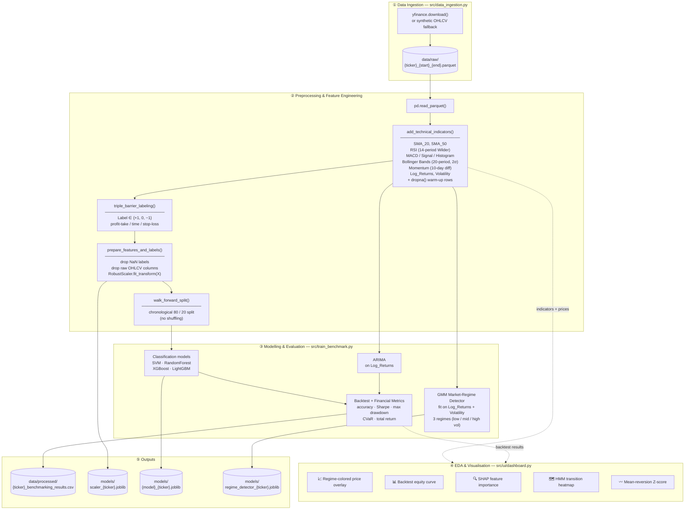

# ML-for-Trading Pipeline Diagram

End-to-end data flow from raw OHLCV ingestion through preprocessing, EDA, model training, and output generation.

---

## Stage → Code Mapping

| Stage | Key function(s) | File |
|---|---|---|
| Fetch OHLCV | `fetch_stock_data()`, `_build_synthetic_ohlcv()` | `src/data_ingestion.py` |
| Technical indicators | `add_technical_indicators()` | `src/features/technical_indicators.py` |
| Triple-barrier labeling | `triple_barrier_labeling()` | `src/features/preprocessing.py` |
| Scale & split features | `prepare_features_and_labels()`, `walk_forward_split()` | `src/features/preprocessing.py` |
| Classify + ARIMA | `run_benchmarking()`, `run_arima_benchmark()` | `src/train_benchmark.py` |
| Market-regime detection | `MarketRegimeDetector.fit()` (GMM) | `src/models/market_regime.py` |
| Backtest | `run_advanced_backtest()` | `src/models/backtester.py` |
| EDA / dashboard | all `st.*` + matplotlib/seaborn plots | `src/ui/dashboard.py` |
| Orchestration (prod) | `weekly_retrain()`, `daily_refresh()` | `src/orchestrator.py` |

> **Entry point:** `src/train_benchmark.py::run_full_pipeline()` assembles steps ①–③ in order.
