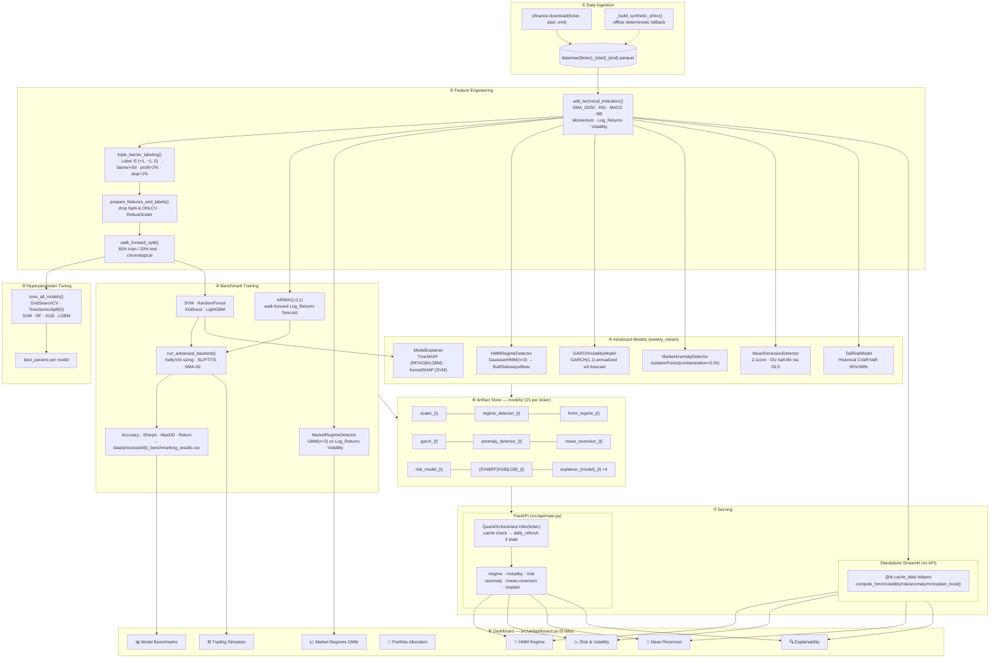
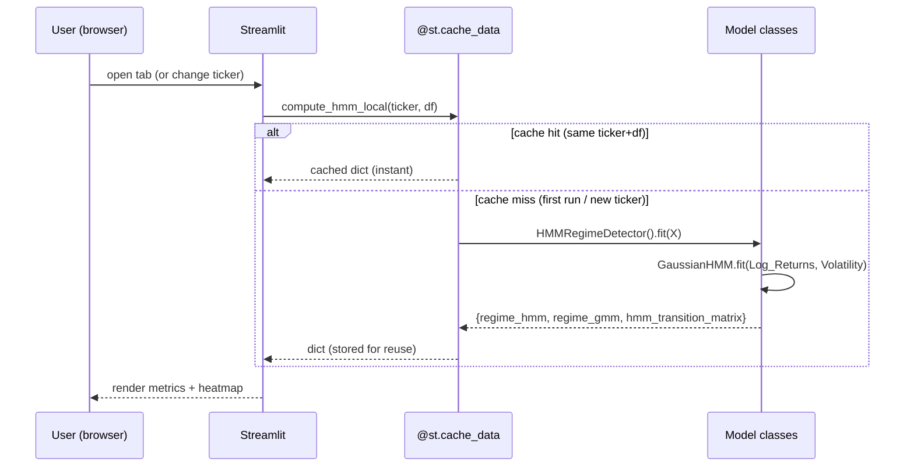

# ML-for-Trading — Full Pipeline Reference

End-to-end data flow from raw OHLCV ingestion through preprocessing, training, orchestration, and dashboard output.

---

## End-to-End Flow

---

## Standalone Compute Detail

Tabs 5–8 work without an API server by fitting models in-process on every **cache miss**:

The same pattern applies to `compute_volatility_local` (GARCH fit ~2s), `compute_risk_local` (instant), `compute_anomaly_local` (IsolationForest ~1s), `compute_mean_reversion_local` (instant), and `compute_explain_local` (tree SHAP ~3s · SVM KernelExplainer ~30s on 50 rows).

---

## Stage → Code Mapping

| Stage | Key function(s) | File |
|---|---|---|
| Fetch OHLCV | `fetch_stock_data()`, `_build_synthetic_ohlcv()` | `src/data_ingestion.py` |
| Technical indicators | `add_technical_indicators()` | `src/features/technical_indicators.py` |
| Triple-barrier labeling | `triple_barrier_labeling()` | `src/features/preprocessing.py` |
| Scale & split | `prepare_features_and_labels()`, `walk_forward_split()` | `src/features/preprocessing.py` |
| Hyperparameter tuning | `tune_model()`, `tune_all_models()` | `src/training/hyperparameter_tuner.py` |
| ML classifiers | `ModelWrapper.train()`, `run_benchmarking()` | `src/train_benchmark.py` |
| ARIMA baseline | `run_arima_benchmark()` | `src/models/model_wrappers.py` |
| GMM regime | `MarketRegimeDetector.fit()` | `src/models/market_regime.py` |
| HMM regime | `HMMRegimeDetector.fit()` | `src/models/regime_hmm.py` |
| GARCH volatility | `GARCHVolatilityModel.fit()`, `.forecast()` | `src/models/volatility_garch.py` |
| Anomaly detection | `MarketAnomalyDetector.fit()` | `src/models/anomaly_detector.py` |
| Mean reversion | `MeanReversionDetector.predict()` | `src/models/mean_reversion.py` |
| Tail risk | `TailRiskModel.fit()`, `.compute()` | `src/models/risk_model.py` |
| SHAP explainability | `ModelExplainer.get_feature_importance()` | `src/models/explainability.py` |
| Backtest | `run_advanced_backtest()` | `src/models/backtester.py` |
| Portfolio | `calculate_{ew|rp|mvo|hrp}_weights()` | `src/models/portfolio_{sizing|hrp}.py` |
| Position sizing | `calculate_position_sizes()` | `src/models/position_sizing.py` |
| Orchestration | `QuantOrchestrator.weekly_retrain()`, `.daily_refresh()` | `src/orchestrator.py` |
| Standalone helpers | `compute_*_local()` | `src/ui/dashboard.py` |
| API serving | all `@app.get` / `@app.post` routes | `src/api/main.py` |

> **Entry point for full training:** `QuantOrchestrator.weekly_retrain(ticker)` — runs all stages in order, saves all 15 artifacts.
> **Entry point for benchmarks only:** `src/train_benchmark.py::run_full_pipeline()` — saves the 6-artifact subset.
